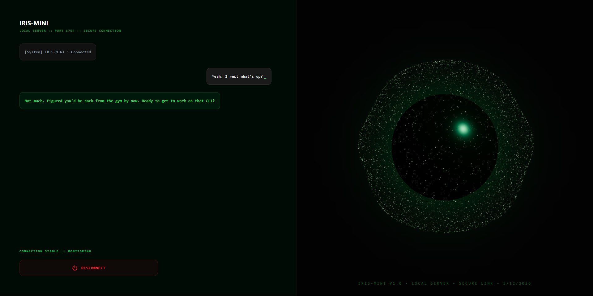
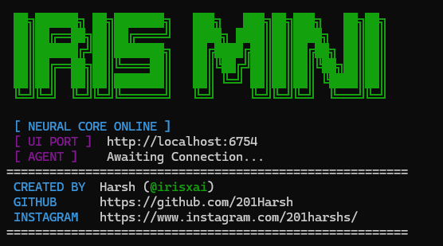

<div align="center">
  
</div>

<p align="center">
  <strong>The Ultimate Desktop Voice Assistant with a Seamless CLI Experience</strong>
</p>

<p align="center">
  <a href="https://www.npmjs.com/package/iris-mini"></a>
  
  
  
  
</p>

---

## 🌟 Overview

**IRIS-MINI** is a production-grade, state-of-the-art Voice AI Assistant. Harnessing the power of the **Google Gemini Live API**, IRIS provides real-time, conversational interactions combined with powerful system integrations.

Whether you prefer a beautiful graphical interface or a blazing-fast command-line experience, IRIS-MINI adapts to your workflow seamlessly.

## 📸 Showcase

| **Premium Web Interface** | **Hacker-Style CLI** |
| :---: | :---: |
|  |  |
| *Beautiful Three.js Visualizer & React UI* | *Clean, Silent & Branded Terminal Experience* |

---

## ✨ Features

- 🎙️ **Advanced Voice AI**: Powered by Google Gemini Live API for real-time, low-latency, and highly intelligent conversational experiences.
- 💻 **Deep OS Integration**: Seamlessly open, close, and manage applications on your local Windows machine.
- 🌍 **Web Search & Knowledge**: Instantly search Google and fetch accurate, up-to-date information.
- 🚀 **CLI Powerhouse**: Exposes an easy-to-use Command Line Interface (CLI) for power users to manage the assistant entirely from the terminal.

## 🛠️ Tech Stack

Built with modern, robust technologies ensuring high performance and a premium feel:

- **Frontend**: React, Tailwind CSS, Framer Motion, Three.js
- **Backend**: Node.js, Express, Socket.io
- **AI Core**: Google Gemini Live API, Glowe Agent
- **System**: Windows API, Decibri (Microphone integration)

## 🔑 Prerequisites

Before you begin, ensure you have obtained the necessary API Keys:

- [Google Gemini API Key](https://aistudio.google.com/app/apikey)

## 🚀 Quick Start & Installation

You can use IRIS-MINI as a globally installed CLI (Recommended) or run it locally from the source code for development.

### Option A: Global CLI Installation (The Primary Path)

The most robust way to experience IRIS is directly through your terminal.

> **⚠️ Important Requirement:** IRIS-MINI strictly requires **Node.js v24+**. Please ensure your environment is updated before proceeding.

#### Step 1: Install Globally
Install the package globally via npm to make the `iris` command available everywhere on your system:

```bash
npm install -g iris-mini
```

#### Step 2: First Run Experience
Launch the assistant for the first time:

```bash
iris
```

On this initial run, an interactive **Setup Wizard** will launch. It will guide you to:
1. Input your **Gemini API Key**.
2. Select your preferred **Voice Personality** (Choose between the crisp tones of *Lyra* or *Puck*).

*Note: Subsequent runs will completely bypass this setup, instantly booting the Neural Core and dropping you straight into the Voice AI experience.*

### Option B: Local Development & Hacker Setup

If you want to poke around the codebase, tweak the UI, or contribute to the project, follow this path.

#### 1. Clone the Repository

```bash
git clone https://github.com/201Harsh/IRIS-Mini.git
cd IRIS-Mini
```

#### 2. Install Dependencies

Ensure you are on Node.js v24+, then run:

```bash
npm install
```

#### 3. Configure Environment Variables

Create a `.env` file in the root directory based on the following template. Replace the placeholders with your actual API keys:

```env
# Google Gemini API Key for Voice AI
GEMINI_API_KEY=your_gemini_api_key_here

```

#### 4. Ignite the Core

Start both the backend server and the React frontend concurrently in development mode:

```bash
npm run dev
```

### Option C: Docker Deployment

For headless environments, homelab servers, or cloud deployments, IRIS-MINI comes fully containerized out-of-the-box.

> **Note:** Running via Docker disables local Windows integrations and native microphone access due to container isolation. It is best suited for network-level access or backend services.

Launch the full stack in detached mode:

```bash
docker-compose up -d --build
```

---

## 🚑 Troubleshooting & Common Issues

Encountering issues? Here are the most common hurdles and how to bypass them:

- **"Unsupported Engine" Error during `npm install`:**
  You are running an older version of Node.js. IRIS-MINI enforces strict environment rules via `.npmrc`. You **must** update to Node.js v24+.

- **Voice AI / Microphone Not Working (Windows):**
  Windows may block terminal apps from accessing your microphone by default. Go to **Windows Settings > Privacy & security > Microphone** and ensure that "Let desktop apps access your microphone" is turned **ON**.

---

## 📂 Project Structure

```text
├── bin/                 # CLI Executable
│   └── iris-mini.ts
├── data/                # Local data storage
│   └── memory.json
├── public/              # Static Assets
├── src/
│   ├── client/          # Premium React Frontend
│   │   ├── assets/
│   │   ├── utils/
│   │   │   └── AICore.tsx
│   │   ├── views/
│   │   │   └── IrisMini.tsx
│   │   ├── App.tsx
│   │   ├── index.css
│   │   └── main.tsx
│   ├── config/          # Configuration handling
│   │   └── dot-env.ts
│   └── server/          # Powerful Node.js Backend
│       ├── agent/       # Core Voice Agent
│       │   └── iris-voice.ts # Gemini Live API
│       ├── constants/
│       │   └── StreamConfig.ts
│       ├── lib/
│       │   └── port-picker.ts
│       ├── tools/       # Specialized Agents
│       │   ├── app-agent.ts
│       │   ├── browser-agent.ts
│       │   └── nexus-agent.ts
│       ├── utils/       # Utility Functions
│       │   └── memory.ts
│       └── main.ts      # Server entrypoint
├── Dockerfile           # Docker Containerization
├── docker-compose.yml   # Multi-container setup
├── .nvmrc               # Node Version Control
├── .npmrc               # NPM Configuration
└── .env                 # Environment Configuration
```

## 🛠️ Developer Experience (DX)

IRIS-MINI is built with a production-ready developer experience in mind. It includes:

- **Node Version Management**: `.nvmrc` and `.npmrc` to strictly control and match Node/NPM environments.
- **Containerization**: Native `Dockerfile` and `docker-compose.yml` support for easy isolated deployments.
- **Code Quality**: Enforced linting and formatting rules via Prettier and Commitlint.
- **Changelog Automation**: Configurations for automated, standardized changelog generation.

## 🤝 Contributing

We welcome contributions from the community! Whether you want to fix bugs, improve documentation, or add new features, please check our [Contributing Guidelines](CONTRIBUTING.md) to get started.

Please ensure you also review our [Code of Conduct](CODE_OF_CONDUCT.md) to keep our community approachable and respectable.

## 🛡️ Security

Security is a priority. For instructions on how to report vulnerabilities and our security practices, please refer to our [Security Policy](SECURITY.md).

## 📄 License

This project is licensed under the terms of the included [LICENSE](LICENSE) file.

---

<p align="center">
  Built with 💚 by 201Harsh.
</p>

